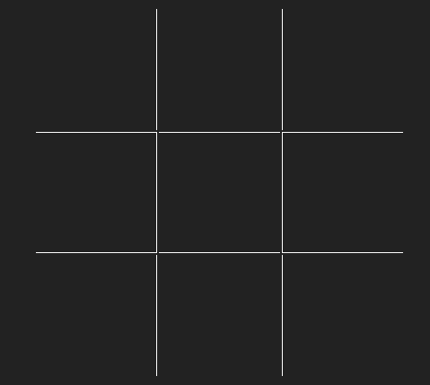
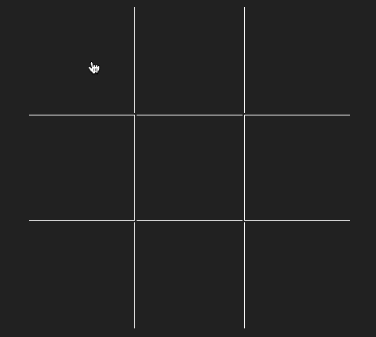
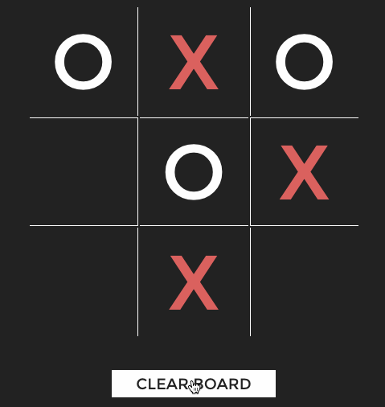
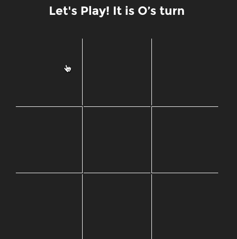
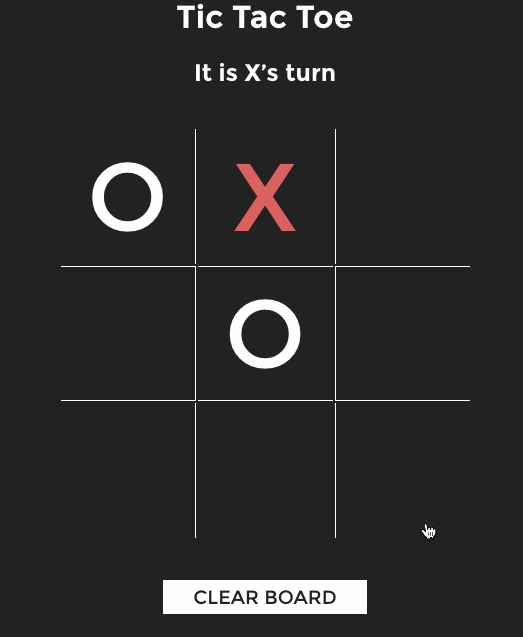
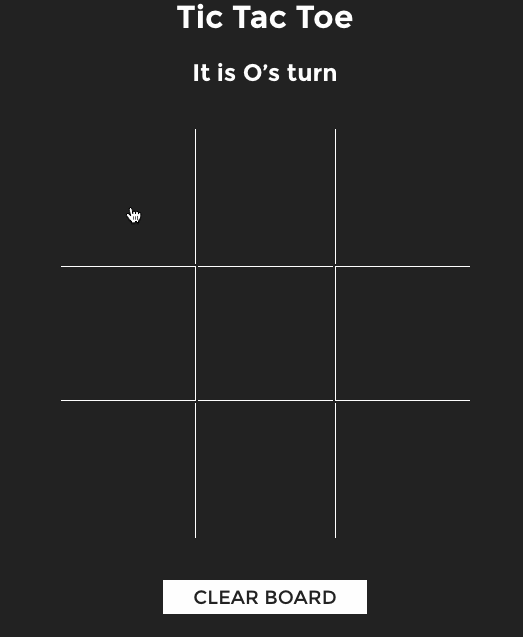

# Week 1 Project - Tic-Tac-Toe

**Objective:** Build a tic-tac-toe game using jQuery.

This week, we learned how we can use jQuery to manipulate the DOM.
This lab will combine those skills with your knowledge of writing functions, working with loops, and writing conditionals.

Are you ready?

## Minimum Requirements
* A user should be able to click on different squares to make a move.
* Every click will alternate between marking an `X` and `O`.
  * HINT #1: You can use the `data-num` attribute that has been provided in your HTML file to figure out which square the user clicked.
  * HINT #2: You'll want to use the `this` keyword here.
* Upon the marking of an individual cell, use JavaScript to set the `data-player` attribute value to "1" or "2", based on the player number.
  * Hint: CSS styles have been added to take advantage of this. See `td[data-player='1']` and `td[data-player='2']`.

  	
* A cell should not be able to be replayed once marked.

  
* When the reset button is clicked, the contents of the board should clear.
  

## How to Get Started
1. The HTML and CSS for this project have been provided for you. For an extra challenge, try building the game from scratch by creating an empty project and building a 3x3 grid using HTML/CSS.
2. Getting started with your JavaScript:
  * Write pseudocode that makes the tic-tac-toe game functional.
  * Ensure the document is ready (`$(onPageLoad)`...) in your JS file before you start working with any DOM elements.
	* Locate the element first in order to use it within your app. With jQuery, you can use your CSS-style selectors to locate elements. 
    - Examples: `$('#elementId')` or `$('tagName')`
	* After finding the elements, start writing logic to listen for `click` events on those elements.
    - Example:
      ```js
      $("button").on("click", function () {
        // Code that should run when button is clicked.
      });
      ```
	* Think about how you can represent a tic-tac-toe game board in JavaScript. What data type would you use? How would you check if there is a winning 3-in-a-row? Whiteboard and pseudocode this- this is the meat of Tic-Tac-Toe!
  * How will you keep track of whose turn it is?

3.

* Display a message to indicate the appropriate player's turn.

  

* When a player clicks a cell, if that cell is empty, set the cell to the correct value (X or O) and advance to the next player.
* Display a message if there is a draw. (After how many moves is there a draw? How can you keep track of that?). Update the reset button with the text: "Play Again."
* If a player gets 3-in-a-row, display that there has been a winner. Update the reset button with the text: "Play Again."

  	
  	

## Ultra Bonus
* We once had a student implement an Artificial Intelligence (A.I.) opponent. If you really need a challenge, write some code that will play a game of tic-tac-toe against you.

## Resources
- [jQuery Cheat Sheet](https://oscarotero.com/jquery/)
- [jQuery Events Documentation](https://api.jquery.com/category/events/)
